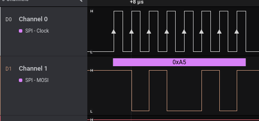

# zephyr-spi-directly
A simple example of how to control the SPI directly in Zephyr RTOS.
The idea comes from this [thread](https://stackoverflow.com/questions/67962637/how-to-use-zephry-spi-driver-directly)

# Tests
It was tested in `nRF52840_mdk` board.

# How to build
```
$ west build -p auto -b nrf52840_mdk
```

# How to flash
```
$ west flash
```
# Application

This can be used to verify if the SPI interface is working properly


